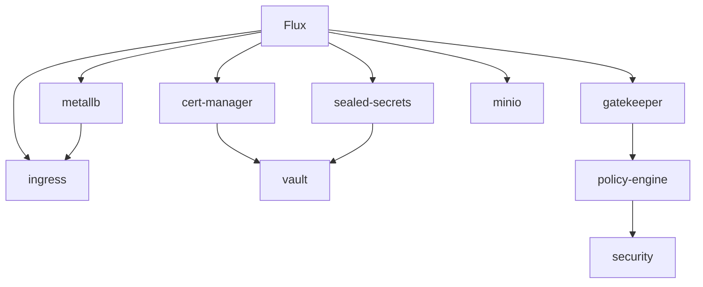
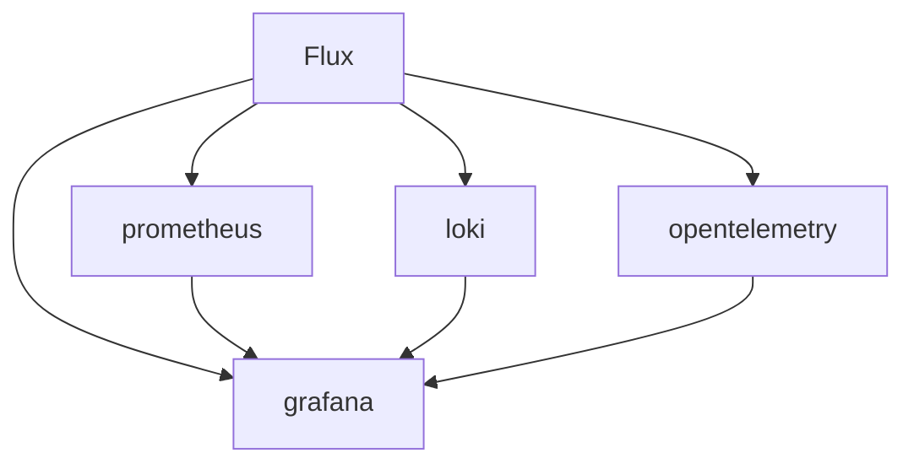
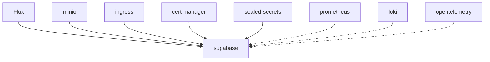
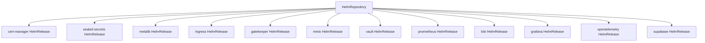

# Component Relationships

This document maps the relationships between different components in the repository.

## Infrastructure Component Relationships

## Component Dependencies

| Component | Depends On | Required By |
|-----------|------------|------------|
| Flux | None | All components |
| cert-manager | Flux | vault, ingress |
| sealed-secrets | Flux | vault, applications |
| metallb | Flux | ingress, minio |
| ingress | Flux, metallb, cert-manager | applications |
| vault | Flux, cert-manager, sealed-secrets | applications (optional) |
| gatekeeper | Flux | policy-engine |
| policy-engine | Flux, gatekeeper | security |
| minio | Flux, metallb | applications |

## Observability Component Relationships

## Application Component Relationships

## Deployment Order Dependencies

The following order should be respected when deploying components:

1. Flux GitOps controllers
2. Core infrastructure:
   a. sealed-secrets
   b. cert-manager
   c. metallb
   d. ingress
3. Security components:
   a. gatekeeper
   b. policy-engine
   c. security
4. Storage:
   a. minio
   b. vault
5. Observability:
   a. prometheus
   b. loki
   c. opentelemetry
   d. grafana
6. Applications

## Configuration Relationships

| Component | Configuration Source | Configuration Target |
|-----------|---------------------|---------------------|
| Flux | clusters/[env]/flux-system/ | flux-system namespace |
| cert-manager | clusters/base/infrastructure/cert-manager/ | cert-manager namespace |
| sealed-secrets | clusters/base/infrastructure/sealed-secrets/ | sealed-secrets namespace |
| metallb | clusters/base/infrastructure/metallb/ | metallb-system namespace |
| ingress | clusters/base/infrastructure/ingress/ | ingress-nginx namespace |
| gatekeeper | clusters/base/infrastructure/gatekeeper/ | gatekeeper-system namespace |
| policy-engine | clusters/base/infrastructure/policy-engine/ | gatekeeper-system namespace |
| minio | clusters/base/infrastructure/minio/ | minio namespace |
| vault | clusters/base/infrastructure/vault/ | vault namespace |
| prometheus | clusters/base/observability/prometheus/ | observability namespace |
| loki | clusters/base/observability/loki/ | observability namespace |
| grafana | clusters/base/observability/grafana/ | observability namespace |
| opentelemetry | clusters/base/observability/opentelemetry/ | observability namespace |
| supabase | clusters/base/applications/supabase/ | supabase namespace |

## Resource Relationships

### Kustomization Resources

```mermaid
graph TD
    A[clusters/base/kustomization.yaml] --> B[clusters/base/infrastructure/kustomization.yaml]
    A --> C[clusters/base/observability/kustomization.yaml]
    A --> D[clusters/base/applications/kustomization.yaml]
    
    B --> E[infrastructure/cert-manager/kustomization.yaml]
    B --> F[infrastructure/sealed-secrets/kustomization.yaml]
    B --> G[infrastructure/metallb/kustomization.yaml]
    B --> H[infrastructure/ingress/kustomization.yaml]
    B --> I[infrastructure/gatekeeper/kustomization.yaml]
    B --> J[infrastructure/policy-engine/kustomization.yaml]
    B --> K[infrastructure/minio/kustomization.yaml]
    B --> L[infrastructure/vault/kustomization.yaml]
    B --> M[infrastructure/security/kustomization.yaml]
    
    C --> N[observability/prometheus/kustomization.yaml]
    C --> O[observability/loki/kustomization.yaml]
    C --> P[observability/grafana/kustomization.yaml]
    C --> Q[observability/opentelemetry/kustomization.yaml]
    C --> R[observability/common/kustomization.yaml]
    C --> S[observability/network/kustomization.yaml]
    
    D --> T[applications/supabase/kustomization.yaml]
```

### HelmRelease Dependencies

