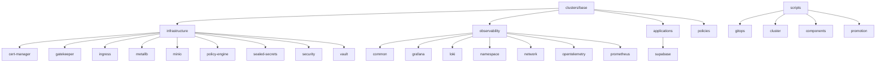

# Repository Component Overview

## Core Components

### Cluster Infrastructure
- **clusters/base/infrastructure** - Base infrastructure configurations
- **clusters/base/observability** - Monitoring and observability stack
- **clusters/base/applications** - Application configurations
- **clusters/base/policies** - Cluster security policies

### GitOps
- **scripts/gitops** - GitOps automation scripts
- **scripts/cluster** - Cluster setup scripts
- **scripts/components** - Component management scripts
- **scripts/promotion** - Environment promotion scripts

### Documentation
- **conext/** - Project context and requirements
- **docs/** - User documentation

## Component Relationships

