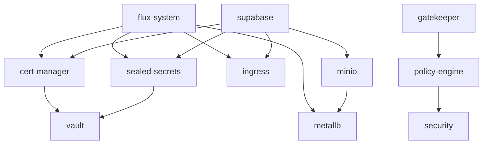
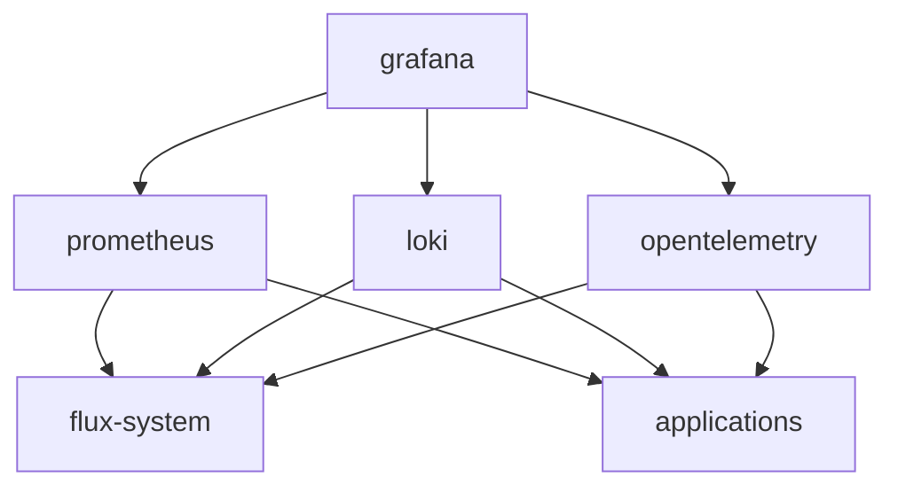

# Component Dependency Graph

This document outlines the dependencies between components in the repository.

## Infrastructure Dependencies

## Component Dependencies Table

| Component | Depends On | Required For |
|-----------|------------|--------------|
| flux-system | None | All components |
| cert-manager | flux-system | ingress, vault, applications |
| sealed-secrets | flux-system | applications, vault |
| metallb | flux-system | ingress, minio |
| ingress | flux-system, metallb, cert-manager | applications |
| vault | cert-manager, sealed-secrets | applications (optional) |
| gatekeeper | flux-system | policy-engine |
| policy-engine | gatekeeper | security |
| security | policy-engine | applications |
| minio | metallb | applications |
| supabase | minio, ingress, cert-manager, sealed-secrets | None |

## Deployment Order

For a new cluster, components should be deployed in this order:

1. flux-system
2. sealed-secrets
3. cert-manager
4. metallb
5. ingress
6. gatekeeper
7. policy-engine
8. security
9. vault
10. minio
11. applications (e.g., supabase)

## Observability Dependencies

## Impact Analysis

When making changes to components, consider the following impact:

| Component | Impact of Changes |
|-----------|------------------|
| flux-system | Affects all components, high risk |
| cert-manager | Affects TLS certificates, medium risk |
| sealed-secrets | Affects secret management, high risk |
| metallb | Affects network connectivity, high risk |
| ingress | Affects external access, medium risk |
| vault | Affects advanced secret management, medium risk |
| gatekeeper | Affects policy enforcement, medium risk |
| policy-engine | Affects security policies, medium risk |
| security | Affects security configurations, medium risk |
| minio | Affects object storage, medium risk |
| supabase | Affects application functionality, low to medium risk |

## Critical Path Components

The following components form the critical path for the cluster:

1. flux-system
2. sealed-secrets
3. metallb
4. cert-manager
5. ingress

These components should be handled with extra care during updates, and changes should be thoroughly tested before applying to production environments.